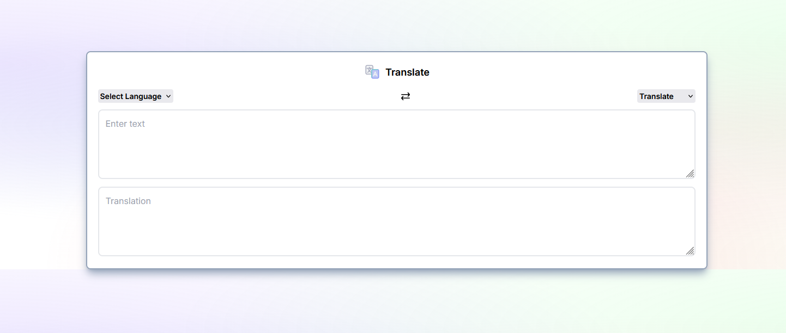

# 🌍 Translation App

A translation application built with **React**, **Next.js**, and **Tailwind CSS**. This app provides real-time translations using the **MyMemory API**, featuring a clean and responsive user interface.



## 🚀 Live Demo
Experience the app live at: [**translaterapp.vercel.app**](https://translaterapp.vercel.app/)

## ✨ Features

- **Real-time Translation**: Instantly translate text between dozens of supported languages.
- **Language Exchange**: Quickly swap "From" and "To" languages with a single click.
- **Clean UI/UX**: Minimalist design with a focus on readability and ease of use.

## 🛠️ Technology Stack

- **Framework**: [Next.js 14+](https://nextjs.org/)
- **Styling**: [Tailwind CSS](https://tailwindcss.com/)
- **API**: [MyMemory Translation API](https://mymemory.translated.net/doc/spec.php)
- **Deployment**: [Vercel](https://vercel.com/)

## 📥 Getting Started

Follow these steps to set up the project locally:

### 1. Clone the repository
```bash
git clone https://github.com/ahmtoz/React-Translation-App.git
cd React-Translation-App
```

### 2. Install dependencies
```bash
npm install
```

### 3. Run the development server
```bash
npm run dev
```

Open [http://localhost:3000](http://localhost:3000) with your browser to see the result.

## 📁 Project Structure

```text
src/
├── app/
│   ├── layout.tsx     # Global layout and fonts
│   ├── globals.css    # Global styles and Tailwind imports
│   ├── page.tsx       # Main page entry
│   └── translate.jsx  # Core translation component logic
├── data.js            # Supported countries and language codes
└── ...
```
